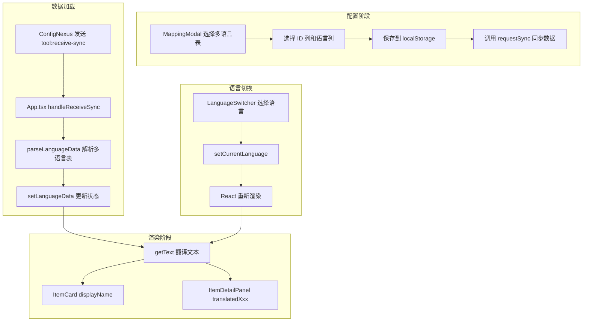

# 多语言支持规范

本规范定义了组件开发中多语言功能的实现标准，以 `bag_app` 为参考模板。

---

## 1. 多语言表结构规范

### 1.1 表格布局

| 行 | A 列 (ID) | B 列 (Key/备注) | C 列起 (语言列) |
|----|-----------|-----------------|-----------------|
| 1  | 字段名称  | Key             | 语言名称        |
| 2  | 字段类型  | string          | string          |
| 3  | 字段说明  | 文本标识        | 翻译文本        |
| 4+ | 数据行    | itemName_1      | 回复药剂        |

> [!NOTE]
> 语言列从第 3 列 (C 列) 开始，第 3 行存储语言名称（如 简中、繁中、EN）

### 1.2 示例数据

```
| ID           | Key   | 简中     | 繁中     | EN          |
|--------------|-------|----------|----------|-------------|
| itemName_1   | 名称  | 回复药剂 | 回復藥劑 | Heal Potion |
| itemType_1   | 类型  | 药品     | 藥品     | Medicine    |
| itemTxt_1    | 说明  | 恢复50HP | 恢復50HP | Restore 50HP|
```

---

## 2. 类型定义 (types.ts)

```typescript
// 多语言表映射
export interface LanguageFieldMapping {
  sheetName: string;      // 多语言工作表名称
  startRow: number;       // 数据起始行（1-indexed）
  idColumn: string;       // ID 列（如 "A"）
  langColumns: string[];  // 语言列列表（如 ["C", "D", "E"]）
  langNames?: string[];   // 语言名称列表（从第3行读取）
}

// 多语言数据 Map: ID -> { langName: text }
export type LanguageData = Map<string, { [lang: string]: string }>;

// 默认配置
export const DEFAULT_LANGUAGE_MAPPING: LanguageFieldMapping = {
  sheetName: '',
  startRow: 4,
  idColumn: 'A',
  langColumns: []
};

// localStorage Key
export const STORAGE_KEY_LANGUAGE_MAPPING = 'bag_app_language_mapping';

// getText 工具函数
export function getText(
  id: string | undefined,
  langData: LanguageData,
  currentLang: string
): string {
  if (!id) return '';
  const entry = langData.get(id);
  if (!entry) return id;  // 未找到返回原 ID
  return entry[currentLang] || entry['简中'] || Object.values(entry)[0] || id;
}
```

---

## 3. MappingModal 多语言配置

### 3.1 Tab 分页设计

```tsx
const [activeTab, setActiveTab] = useState<'data' | 'language'>('data');
```

- **Tab 1: 数据配置表** - 业务数据字段映射
- **Tab 2: 多语言表** - 多语言表映射配置

### 3.2 多语言表 UI 组件

```tsx
{/* 多语言工作表选择 */}
<select
  value={languageMapping.sheetName}
  onChange={(e) => handleLangSheetChange(e.target.value)}
>
  <option value="">请选择</option>
  {sheets.map(sheet => (
    <option key={sheet.name} value={sheet.name}>{sheet.name}</option>
  ))}
</select>

{/* 数据起始行 */}
<input
  type="number"
  value={languageMapping.startRow}
  onChange={(e) => setLanguageMapping(prev => ({ 
    ...prev, 
    startRow: parseInt(e.target.value) || 4 
  }))}
/>

{/* ID 列选择 */}
<select
  value={languageMapping.idColumn}
  onChange={(e) => setLanguageMapping(prev => ({ 
    ...prev, 
    idColumn: e.target.value 
  }))}
>
  {langSheetColumns.map(col => (
    <option key={col.letter} value={col.letter}>
      {col.letter} - {col.name}
    </option>
  ))}
</select>

{/* 语言列多选 - 从第三列开始 */}
{langSheetColumns.slice(2).map(col => (
  <label key={col.letter}>
    <input
      type="checkbox"
      checked={languageMapping.langColumns.includes(col.letter)}
      onChange={() => toggleLangColumn(col.letter)}
    />
    {col.name || col.letter}
  </label>
))}
```

### 3.3 保存时更新语言名称列表

```typescript
const handleSave = async () => {
  // 获取已选择语言列的名称
  const langNames = languageMapping.langColumns.map(letter => {
    const col = langSheetColumns.find(c => c.letter === letter);
    return col?.name || letter;
  });
  
  // 保存时包含语言名称
  localStorage.setItem(STORAGE_KEY_LANGUAGE_MAPPING, JSON.stringify({
    ...languageMapping,
    langNames  // 供 App.tsx 使用
  }));
  
  // 请求同步数据
  if (window.electronAPI?.requestSync) {
    await window.electronAPI.requestSync('bag');
  }
  
  // 关闭弹窗（不刷新页面）
  onClose();
};
```

### 3.4 语言列切换时通知父组件

```typescript
interface MappingModalProps {
  isOpen: boolean;
  onClose: () => void;
  onLanguagesChange?: (languages: string[]) => void;  // 动态更新语言列表
}

const toggleLangColumn = (letter: string) => {
  setLanguageMapping(prev => {
    const exists = prev.langColumns.includes(letter);
    const newLangColumns = exists
      ? prev.langColumns.filter(c => c !== letter)
      : [...prev.langColumns, letter];
    
    // 通知父组件更新语言列表
    if (onLanguagesChange) {
      const langNames = newLangColumns.map(col => {
        const found = langSheetColumns.find(c => c.letter === col);
        return found?.name || col;
      });
      onLanguagesChange(langNames);
    }
    
    return { ...prev, langColumns: newLangColumns };
  });
};
```

---

## 4. App.tsx 多语言集成

### 4.1 状态定义

```typescript
// 多语言状态
const [availableLanguages, setAvailableLanguages] = useState<string[]>(() => {
  try {
    const saved = localStorage.getItem('bag_app_language_mapping');
    if (saved) {
      const mapping = JSON.parse(saved);
      if (mapping.langNames?.length > 0) {
        return mapping.langNames;
      }
    }
  } catch (e) {}
  return ['简中'];
});
const [currentLanguage, setCurrentLanguage] = useState<string>('简中');
const [languageData, setLanguageData] = useState<LanguageData>(new Map());
```

### 4.2 解析多语言数据

```typescript
const parseLanguageData = (rawData: any[][], langMapping: any): LanguageData => {
  const data: LanguageData = new Map();
  const { startRow, idColumn, langColumns, langNames } = langMapping;

  const colToIndex = (col: string): number => {
    if (!col) return -1;
    col = col.toUpperCase();
    let idx = 0;
    for (let i = 0; i < col.length; i++) {
      idx = idx * 26 + (col.charCodeAt(i) - 64);
    }
    return idx - 1;
  };

  const idIdx = colToIndex(idColumn);
  const langIndices = langColumns.map((col: string) => colToIndex(col));

  for (let i = startRow - 1; i < rawData.length; i++) {
    const row = rawData[i];
    if (!row) continue;

    const id = idIdx >= 0 ? String(row[idIdx] || '').trim() : '';
    if (!id) continue;

    const translations: { [lang: string]: string } = {};
    langIndices.forEach((colIdx: number, langIdx: number) => {
      if (colIdx >= 0 && row[colIdx] !== undefined) {
        const langName = (langNames?.[langIdx]) || langColumns[langIdx];
        translations[langName] = String(row[colIdx] || '');
      }
    });

    data.set(id, translations);
  }

  return data;
};
```

### 4.3 数据同步时加载多语言

```typescript
useEffect(() => {
  const handleReceiveSync = (payload: { sheetData: any }) => {
    const { sheetData } = payload;
    
    // 1. 加载业务数据映射
    // ...
    
    // 2. 加载多语言数据
    let langMapping = null;
    try {
      const saved = localStorage.getItem('bag_app_language_mapping');
      if (saved) langMapping = JSON.parse(saved);
    } catch (e) {}
    
    if (langMapping?.sheetName) {
      const langSheetData = sheetData[langMapping.sheetName];
      if (langSheetData?.length) {
        const parsedLangData = parseLanguageData(langSheetData, langMapping);
        setLanguageData(parsedLangData);
      }
    }
  };
  
  window.addEventListener('tool:receive-sync', handleReceiveSync);
  return () => window.removeEventListener('tool:receive-sync', handleReceiveSync);
}, []);
```

### 4.4 传递翻译给子组件

```tsx
{/* ItemCard - 物品卡片 */}
<ItemCard
  item={item}
  displayName={getText(item.name, languageData, currentLanguage)}
/>

{/* ItemDetailPanel - 物品详情 */}
<ItemDetailPanel
  item={selectedItem}
  translatedName={getText(selectedItem?.name, languageData, currentLanguage)}
  translatedItemType={getText(selectedItem?.itemType, languageData, currentLanguage)}
  translatedItemTxt={getText(selectedItem?.itemTxt, languageData, currentLanguage)}
/>
```

---

## 5. LanguageSwitcher 组件

### 5.1 使用 Portal 确保层级

```tsx
import ReactDOM from 'react-dom';

export const LanguageSwitcher = ({ 
  availableLanguages,
  currentLanguage,
  onLanguageChange 
}) => {
  const [isOpen, setIsOpen] = useState(false);
  
  // 少于 2 种语言时不显示
  if (availableLanguages.length <= 1) return null;
  
  return (
    <>
      <button onClick={() => setIsOpen(true)}>
        <Globe size={20} />
      </button>
      
      {/* 使用 Portal 渲染到 body 确保层级最高 */}
      {isOpen && ReactDOM.createPortal(
        <div className="fixed inset-0 z-[9999] ...">
          {availableLanguages.map(lang => (
            <button
              key={lang}
              onClick={() => {
                onLanguageChange(lang);
                setIsOpen(false);
                // 不刷新页面，由 React 状态驱动更新
              }}
            >
              {lang}
            </button>
          ))}
        </div>,
        document.body
      )}
    </>
  );
};
```

### 5.2 与 App.tsx 集成

```tsx
// TopBar 中的语言切换按钮
<LanguageSwitcher
  availableLanguages={availableLanguages}
  currentLanguage={currentLanguage}
  onLanguageChange={setCurrentLanguage}
/>

// MappingModal 中动态更新语言列表
<MappingModal
  isOpen={isMappingModalOpen}
  onClose={() => setIsMappingModalOpen(false)}
  onLanguagesChange={setAvailableLanguages}
/>
```

---

## 6. 子组件多语言支持

### 6.1 ItemCard 组件

```tsx
interface ItemCardProps {
  item: Item;
  displayName?: string;  // 翻译后的名称
  // ...
}

export const ItemCard = ({ item, displayName }) => {
  const nameToShow = displayName || item.name;
  
  return (
    <span>{nameToShow}</span>
  );
};
```

### 6.2 ItemDetailPanel 组件

```tsx
interface ItemDetailPanelProps {
  item: Item | null;
  translatedName?: string;
  translatedItemType?: string;
  translatedItemTxt?: string;
}

export const ItemDetailPanel = ({
  item,
  translatedName,
  translatedItemType,
  translatedItemTxt
}) => {
  const displayName = translatedName || item.name;
  const displayItemType = translatedItemType || item.itemType;
  const displayItemTxt = translatedItemTxt || item.itemTxt;
  
  return (
    <>
      <h2>{displayName}</h2>
      <span>TYPE: {displayItemType}</span>
      <p>{displayItemTxt}</p>
    </>
  );
};
```

---

## 7. 完整数据流



---

## 8. localStorage 存储键

| 应用 | 存储键 |
|------|--------|
| bag_app | `bag_app_language_mapping` |
| mail_app | `mail_app_language_mapping` |
| task_app | `task_app_language_mapping` |
| dialogue_app | `dialogue_app_language_mapping` |

---

## 9. 最佳实践

1. **ID 命名**：使用 `{field}_{id}` 格式，如 `itemName_1`
2. **默认语言**：始终以 `简中` 作为回退
3. **Portal 弹窗**：使用 `ReactDOM.createPortal` 确保层级
4. **不刷新切换**：语言切换由 React 状态驱动，无需刷新页面
5. **数据同步**：保存配置后调用 `requestSync` 而非刷新页面

---

## 10. 参考实现

| 应用 | 路径 | 说明 |
|------|------|------|
| bag_app | `app/bag_app` | **完整模板**，包含所有功能 |
| dialogue_app | `app/dialogue_app` | 对话系统多语言 |
